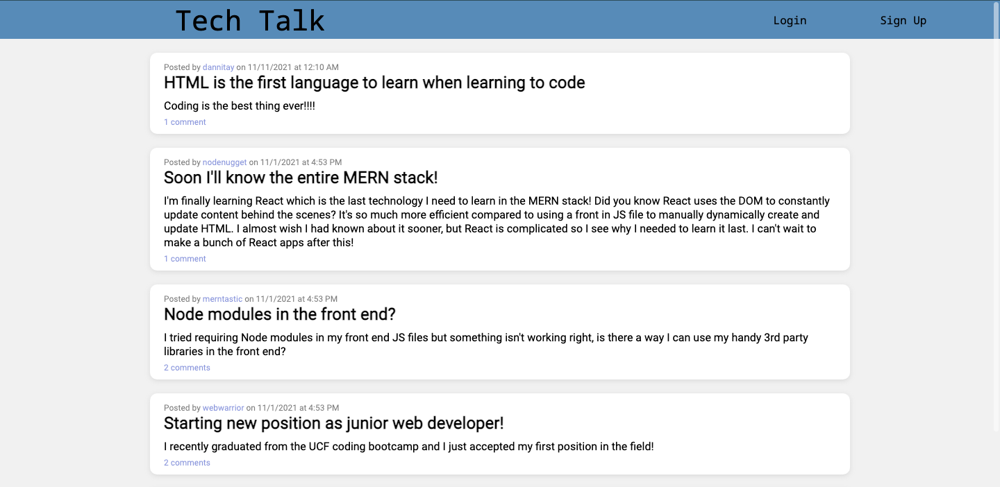

# Tech Talk

## Description

Welcome to Tech Talk, your destination for communicating about today's technology. Tech gives you all the tools you need to discover, connect, and share in the technology community. Create an account, write your first post, and browse what others are talking about.

## Table of Contents

* [Usage](#usage)
* [Deployment](#deployment)
* [License](#license)
* [Credits](#credits)
* [Authors](#authors)
* [Questions](#questions)

## Usage

When you first arrive at the homepage, you'll see a wall of current blog posts as well as links to login and to sign up as a new user. After signing up with a username and password, you'll be able to comment on other's posts and write your own. To write your own post, navigate to the Dashboard, click the "New Post" button, and fill out the post form. You can comment on other posts by clicking the comments link on the post, typing a comment in the "Add a comment..." box and pressing enter. Enjoy Tech Talk!

## Deployment

The deployed application can be found [here](https://nameless-hollows-07003.herokuapp.com/).

## License

[MIT](./LICENSE.txt)

## Credits

Technologies

* [Node.js](https://nodejs.org/en/)
* [MySQL](https://www.mysql.com/)

NPM Dependencies

* [Express](https://www.npmjs.com/package/express)
* [Sequelize](https://sequelize.org/)
* [dotenv](https://www.npmjs.com/package/dotenv)

Font Awesome Icons

* [times](https://fontawesome.com/v5.15/icons/times?style=solid)
* [edit](https://fontawesome.com/v5.15/icons/edit?style=solid)

## Authors

Aidan Amato

## Questions

Please reach out if you have any additional questions!

* [GitHub](https://github.com/aidanamato)
* [Email](mailto:aidanamato@comcast.net)